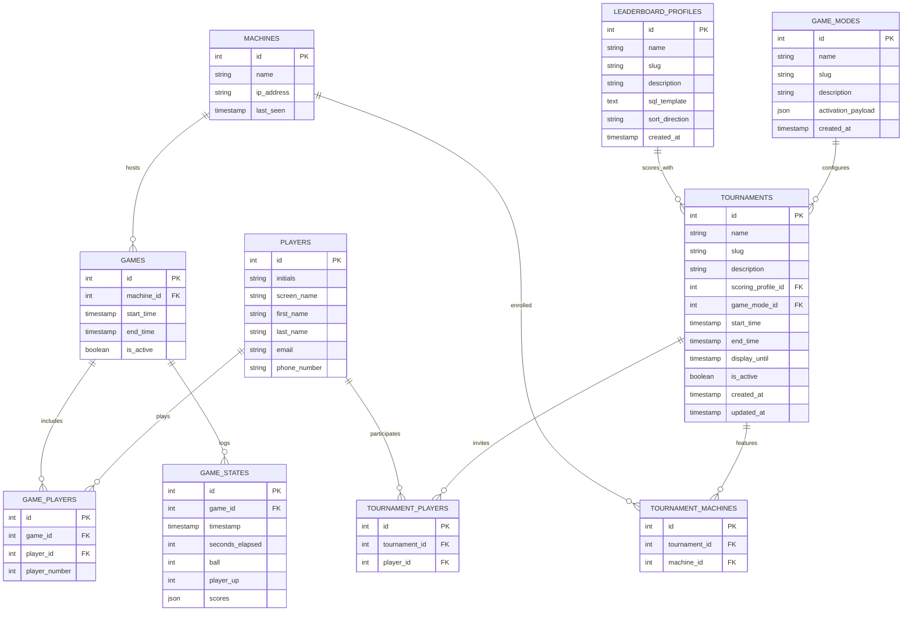

# Origin

This repository contains the "Origin" application, a Dockerized service designed to act as a central hub for Warped Pinball "Vector" boards. It receives game state updates via UDP, stores them in a SQLite database, and provides a Web API/UI for leaderboards and active game monitoring.

## Architecture

The system consists of:
1.  **Origin App**: A Python (FastAPI) application.
    -   **UDP Listener (Port 6809)**: Receives real-time game data (ball, player, score, time) from pinball boards.
    -   **Web API (Port 8000)**: Serves data to the frontend UI.
2.  **SQLite Database**: Stores persistent data about machines, games, and scores without requiring an external service.

### Database Schema (ER Diagram)



### Tournament setup workflow

The full tournament admin workflow and leaderboard behaviors now live in [`api_app/TOURNAMENTS.md`](api_app/TOURNAMENTS.md).

## Docker Usage

### Prerequisites
- Docker
- Docker Compose

### Running with Docker Compose (Recommended)

The easiest way to run the hub and its bundled SQLite storage together is using Docker Compose. A project name of
`the-box-dev` is provided via the root `.env` file (`COMPOSE_PROJECT_NAME=the-box-dev`) to prevent clashes with any older
containers you may have from previous Compose setups.

1.  **Start/stop services with the helper script** (cleans up stale containers that can trigger `ContainerConfig` errors):
    ```bash
    ./scripts/run_local.sh start   # down --remove-orphans, then up --build -d
    ./scripts/run_local.sh stop    # down --remove-orphans (keeps volumes)
    ./scripts/run_local.sh restart # stop then start
    ./scripts/run_local.sh clean   # down --volumes --remove-orphans
    ```
    The script sets `COMPOSE_PROJECT_NAME` to `the-box-dev` (or uses your exported value) and ensures old Compose containers
    are removed before spinning up the stack. If you prefer raw commands, you can still run `docker-compose up --build` from the
    repository root.

2.  **Access the Application**:
    -   **Web API**: [http://localhost:8000](http://localhost:8000)
-   **UDP Listener**: `localhost:6809` (UDP)

3.  **(If you previously used the old project name)** remove any legacy containers/volumes that might conflict:
    ```bash
    docker-compose down --remove-orphans
    docker volume prune --filter label=com.docker.compose.project=the-box -f || true
    ```
    This clears out stale containers like `the-box_db_1` that can trigger `ContainerConfig` errors when recreating the app
    service.

4.  **Stop the services**:
    ```bash
    docker-compose down
    ```

### Building the Docker Image Manually

If you want to build the image without Compose:

```bash
docker build -t origin .
```

### Running the Container Manually

To run the container standalone (requires a running database):

```bash
docker run -p 8000:8000 -p 6809:6809/udp \
  -e DATABASE_URL="sqlite+aiosqlite:///app/data/app.db" \
  origin
```

## Configuration

The application is configured via environment variables:

| Variable | Description | Default |
| :--- | :--- | :--- |
| `DATABASE_URL` | Connection string for database | `sqlite+aiosqlite:///absolute/path/to/data/app.db` |

## CI/CD

A GitHub Actions workflow (`.github/workflows/publish.yml`) is configured to automatically build and publish the Docker image to GitHub Container Registry (GHCR) on every push to the `main` branch.
